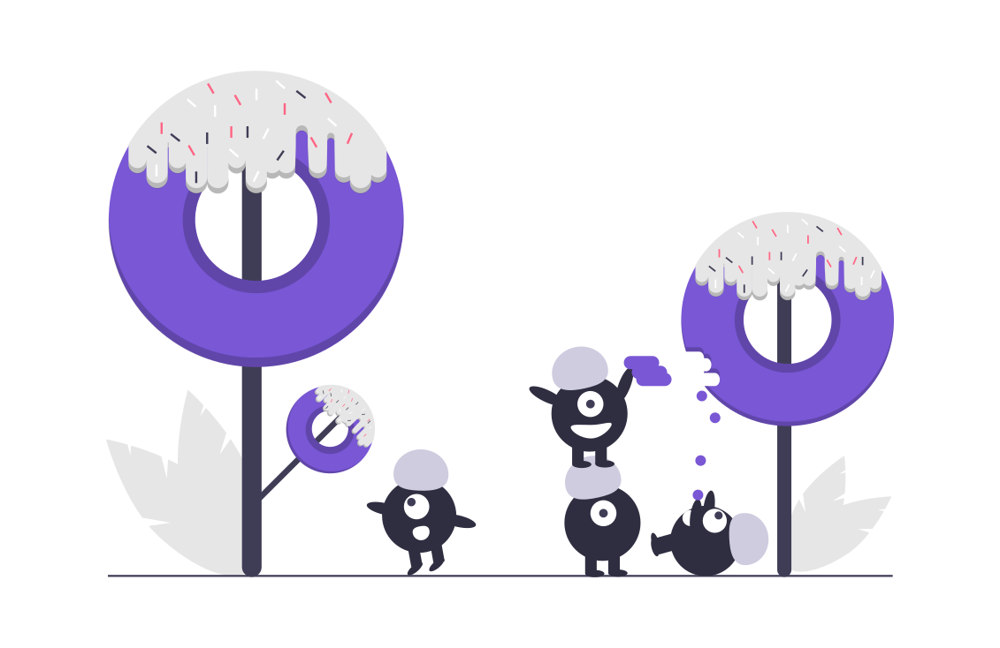

<p align="center">
        
</p>

## Hi 👋, I'm [Arslan Goraya!](https://www.linkedin.com/in/arslan-goraya-138b10198/) 

<!-- HeadLine !-->

    
> Be Creative and Unique - **A Goraya** 💕


<!-- Social Links !-->
 _Join the Ecosystem 💫_

<a href="https://www.linkedin.com/in/arslan-goraya-138b10198/">
  
</a>
<a href="https://github.com/gorayaa66">
  
</a>

<br/>

### About me 🚀
- 🌱 Works on **MERN**, **React Native**, **Svelte**, **Sveltekit**  by passion and now passion is my field
- 👯 Love to help people and grow as a community
- 👣 I like Chess and Cricket



```
    Human Information
    ------------------------------------------
    Name: Arslan Goraya
    Username: gorayaa66
    Gender: Male
    Age: 27
    Hobbies: ["Blogging"], ["Journaling"], ["Books Reading"], ["Opensource"],["Traveling"]
    Languages: ["Urdu"], ["English US"], ["English UK"]
    University: Comsats University, Lahore
```

<br>


